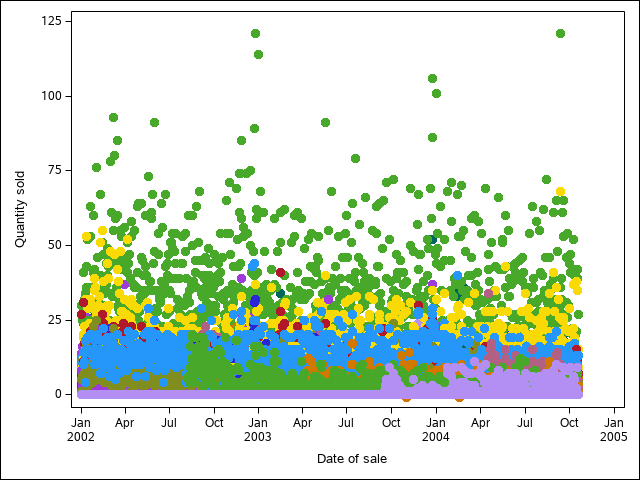

```{r load-sas-libraries, echo =T, message = F, warning = F}
library(SASmarkdown)
sas_enginesetup()
```

Save the code as a SAS file so that we can show both its use in a code chunk and on the command line...

```{r echo=T}
readLines("reprex.sas")
```


```{r as-in-book, engine="sashtml", engine.path = "sas"}
%include 'reprex.sas';
```


```{r}
system('sas reprex.sas')
```


